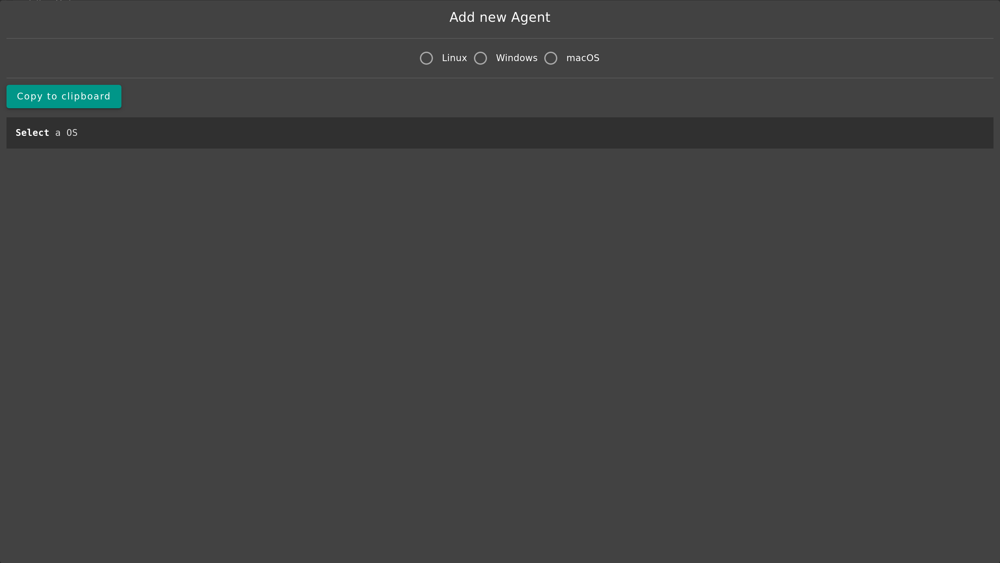
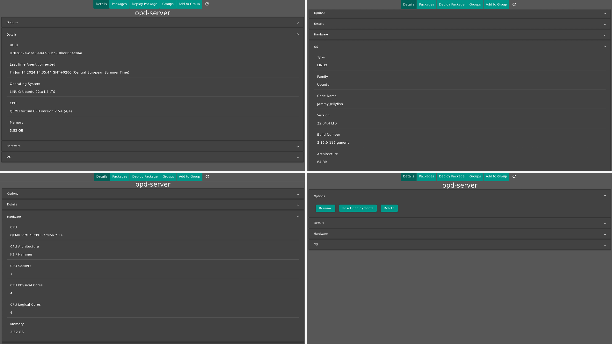
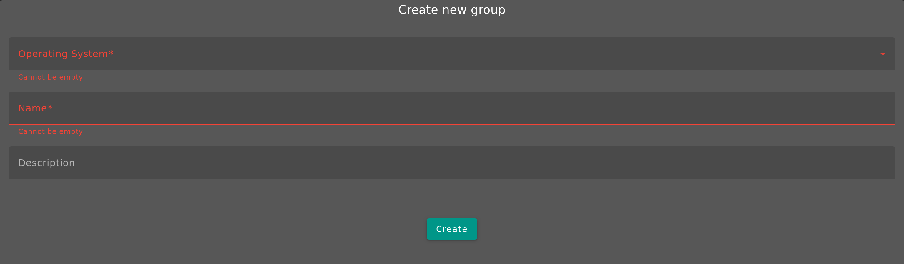
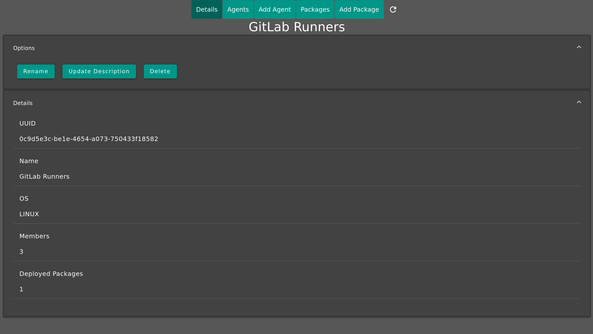
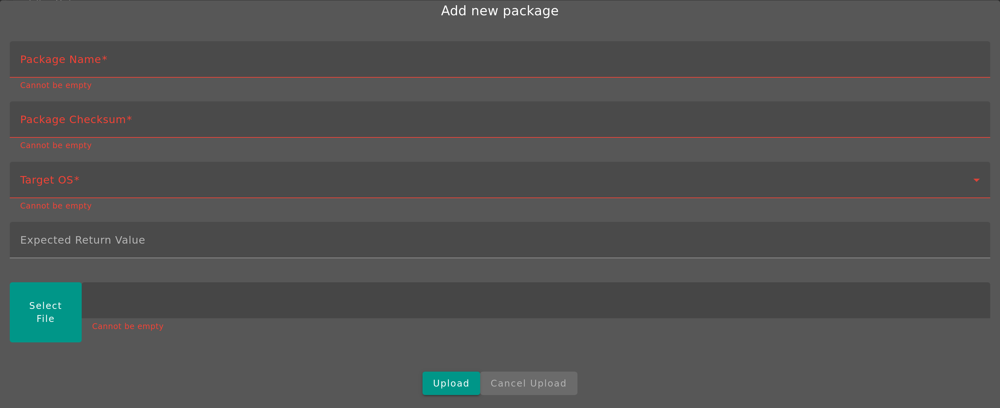
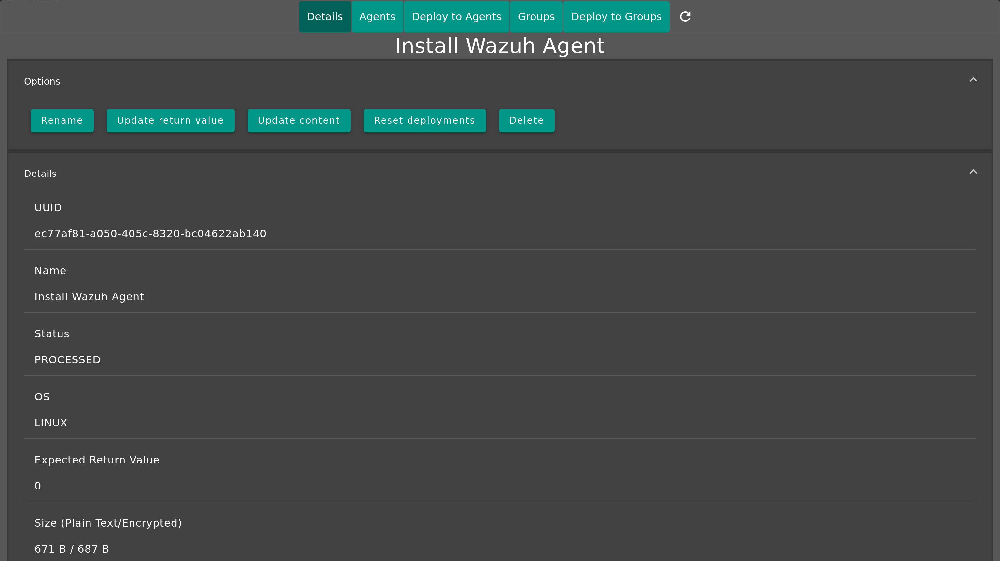
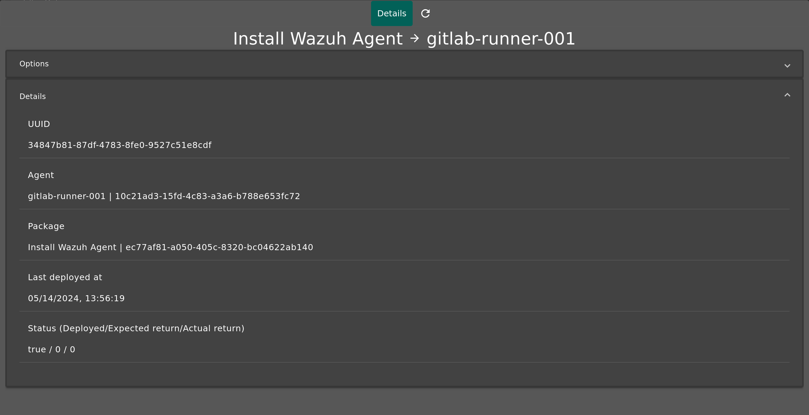

# User Guide

<!-- TOC -->
* [User Guide](#user-guide)
* [Filter Options](#filter-options)
* [Dashboard](#dashboard)
* [Agents](#agents)
  * [Add a new Agent](#add-a-new-agent)
  * [Agent Details](#agent-details)
* [Groups](#groups)
  * [Create new Group](#create-new-group)
  * [Group Details](#group-details)
* [Packages](#packages)
  * [Add new Package](#add-new-package)
  * [Package Details](#package-details)
* [Deployments](#deployments)
  * [When is a package successfully deployed](#when-is-a-package-successfully-deployed)
  * [Agent Errors](#agent-errors)
  * [Deployment Details](#deployment-details)
<!-- TOC -->

# Filter Options

Most Pages have `Filter Options`. These Options are stored in the Browsers local storage. In the `Filter Options` you
can select which fields of tables are shown. When you use the Search, it will only search across visible columns in the
tables.

# Dashboard

The Dashboard provides an easy way to get an overview of all important Data.

The dashboard auto-refreshes (the green progressbar under the `Options`-Panel shows when the next refresh happens and
can be configured in the `Options`-Panel).

You can click on:

* Agent Status:
    * Inactive
    * Outdated
* Package Status
    * Unprocessed
    * Error
* Deployment Status
    * Outstanding
    * Error

This will open a popup, that also auto-refreshes when the dashboard does and shows you the relevant infos.

# Agents

You can see the status of Agents, as well as add new ones.

## Add a new Agent

When you press the `Add Agent`-Button, a popup will open where you can select your OS and it will show you a script that
you can copy and execute on the Endpoint.

The Script will:

* Install Java
* Download the Agent
* Set up a Service to auto(re)start the Agent
* Set up required config to allow the Agent to register

## Agent Details

When you click on an Agent in the table, a popup with detailed information about it will be opened. You also have some
settings for it.

The Button `Reset Deployments` will reset the status for all deployments for this Agent. The next time it will contact
the Server, the available Packages will be deployed again.

You can also create/remove deployments and add/remove the Agent to/from Groups.

# Groups

OPD has support for groups, to make deployment of multiple Packages simpler. A group is for a specific OS and can have
multiple Packages and Agents.

## Create new Group

To create a new group, simply use the `New Group`-Button. You have to select an OS and a Name with an optional
description.

## Group Details

When you click on a group, you will get an popup, similar to [Agent Details](#agent-details).

# Packages

Here you can manage all of your Packages.

## Add new Package

If you want to add a new Package, press the `Add Package`- Button.

In this popup, you have to specify a Name, the Checksum, the OS and a file. You can optionally specify an expected
return
value.

If you want more information on how to create and add/update a Package, head over to the [Create a Package Guide]().

## Package Details

When opening the details of a Package,

The Button `Reset Deployments` will reset the status for all deployments for this Package.

The Button `Update Content` allows you to upload a Package, that will replace the current one.

# Deployments

Here you have an overview of all deployments.

Explanation of values:

* `Direct Deployment`: If `true` the Package was manually(directly) deployed to the Agent. If `false`, the Package is
  deployed through at minimum one group. If a Package is available through a group and as a direct deployment, it will
  be `true` until the deployment gets deleted. Then it will turn to `false` and is deployed through the group.
* `Deployed`: `true` if the Package was successfully deployed on the Agent, otherwise `false`.
* `Expected Return (Value)`: Is the value specified for the Package itself. Defines when a package is considered
  successfully deployed (more infos
  at [When is a package successfully deployed](#when-is-a-package-successfully-deployed)).
* `Actual Return (Value)`: The value returned from the package (after executing the main script).
* `Last Deployed At/Last Deployment Time`: Time when the Package was deployed on the Agent itself.

## When is a package successfully deployed

* If the `Expectet Return (Value)` for a Package is empty, every response code (except `AGENT-DEPLOYMENT-ERROR`) is
  considered successful.
* If the `Expectet Return (Value)` for a Package is not empty, the deployment is considered successful when the
  Agent reports the specified/required value from the package deployment process.
* A return value starting with `AGENT-DEPLOYMENT-ERROR` is always considered unsuccessful, as it indicates an error
  on the Agent side. More infos at [Agent Errors](#agent-errors)

## Agent Errors

The Agent can return a `return value` starting with `AGENT-DEPLOYMENT-ERROR` to indicate an error. The following errors
can be returned in this case:

* `UNKNOWN_ERROR`: This message should include more details with the actual error that occurred.
  * `Package timeout during deployment`: The deployment was stopped after running for 1 hour.
* `DECRYPTION_FAILED`: An error during the Package decryption process. This could indicate a problem with the downloaded
  file or with the information received from the Server. If it happens on all deployments from a Package, consider
  re-uploading the Package-content.
* `PLAINTEXT_CHECKSUM_MISMATCH`, `ENCRYPTED_CHECKSUM_MISMATCH`: Calculated checksum does not match the one provided from
  the Server. Indicates an error with the download or the decryption.
* `ENTRYPOINT_NOT_FOUND`: The required start script was not found in the Package. Linux and macOS require a filed
  called `start.sh` while Windows requires a `start.bat`-file.

## Deployment Details

