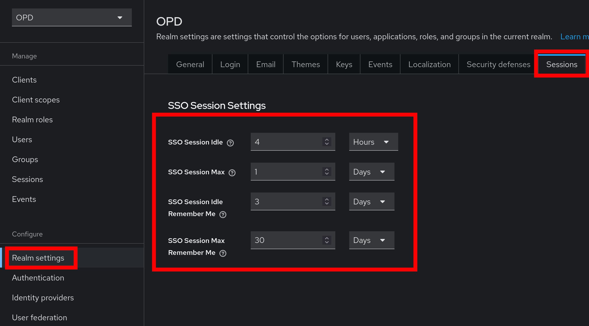

# Recommended Keycloak Settings

<!-- TOC -->
* [Recommended Keycloak Settings](#recommended-keycloak-settings)
* [Disable Registration](#disable-registration)
* [Add SMTP-Server](#add-smtp-server)
* [Stay logged in for longer](#stay-logged-in-for-longer)
* [Create/Add new User](#createadd-new-user)
<!-- TOC -->

All settings must be made in the `OPD`-Realm.

# Disable Registration

By default, everyone can register an account on Keycloak. If you want (and probably should) disable this, head over to
the `Realm Settings` on the navbar and then to `Login`. There, you can disable the registration.

# Add SMTP-Server

Keycloak has the ability to send emails (forgot password, verify new users, etc...). To make use of this, an SMTP server
is required.

Go `Realm Settings` on the navbar and then to the Option `Email`. There, you can set up an SMTP connection to allow
Keycloak to send emails.

# Stay logged in for longer

If you don't want to log in to Keycloak as often, you can increase the `Session Lifetime`. For this, go to
the `Realm Settings` on the navbar and then to the Option `Sessions`.

You can change the `SSO Session Settings` to stay logged in for longer. The image below shows higher values than default.

# Create/Add new User

If you want to add a new user, head over to the [Quickstart Guide](quickstart.md), step 8.