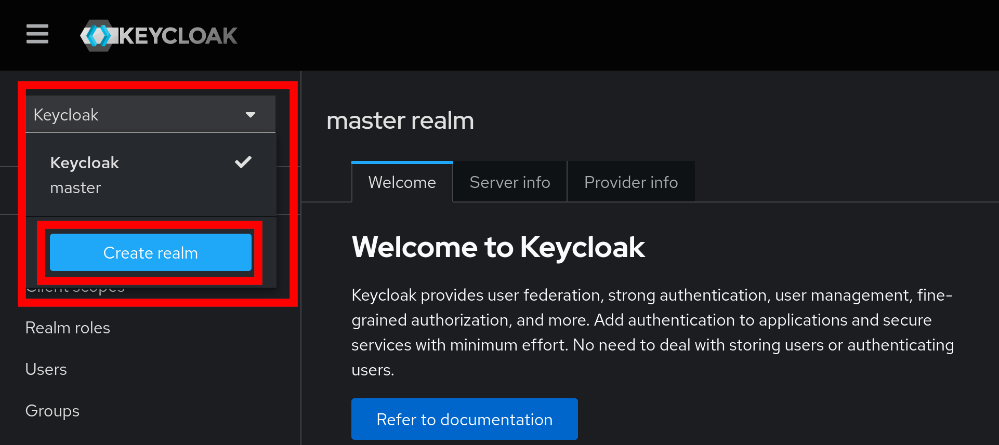
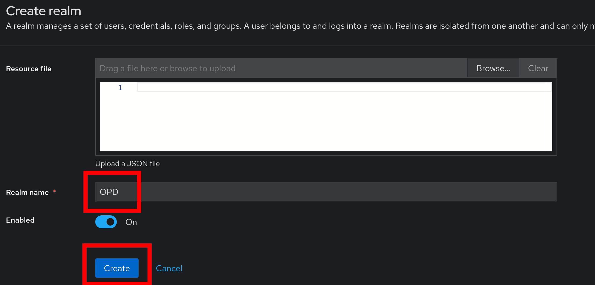
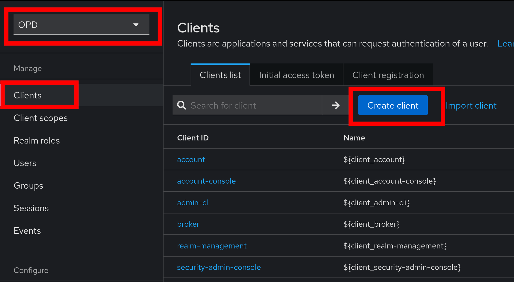
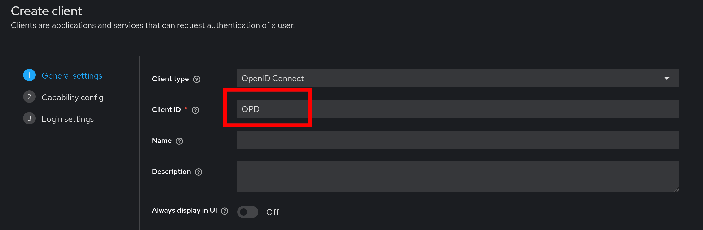
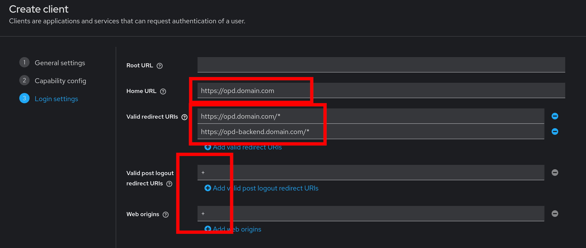
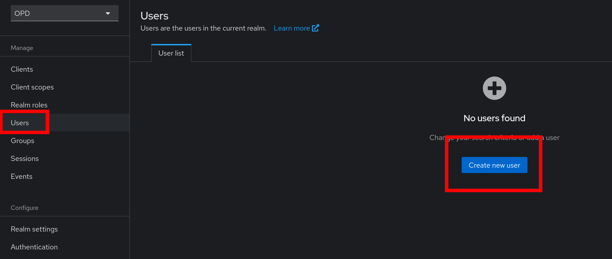
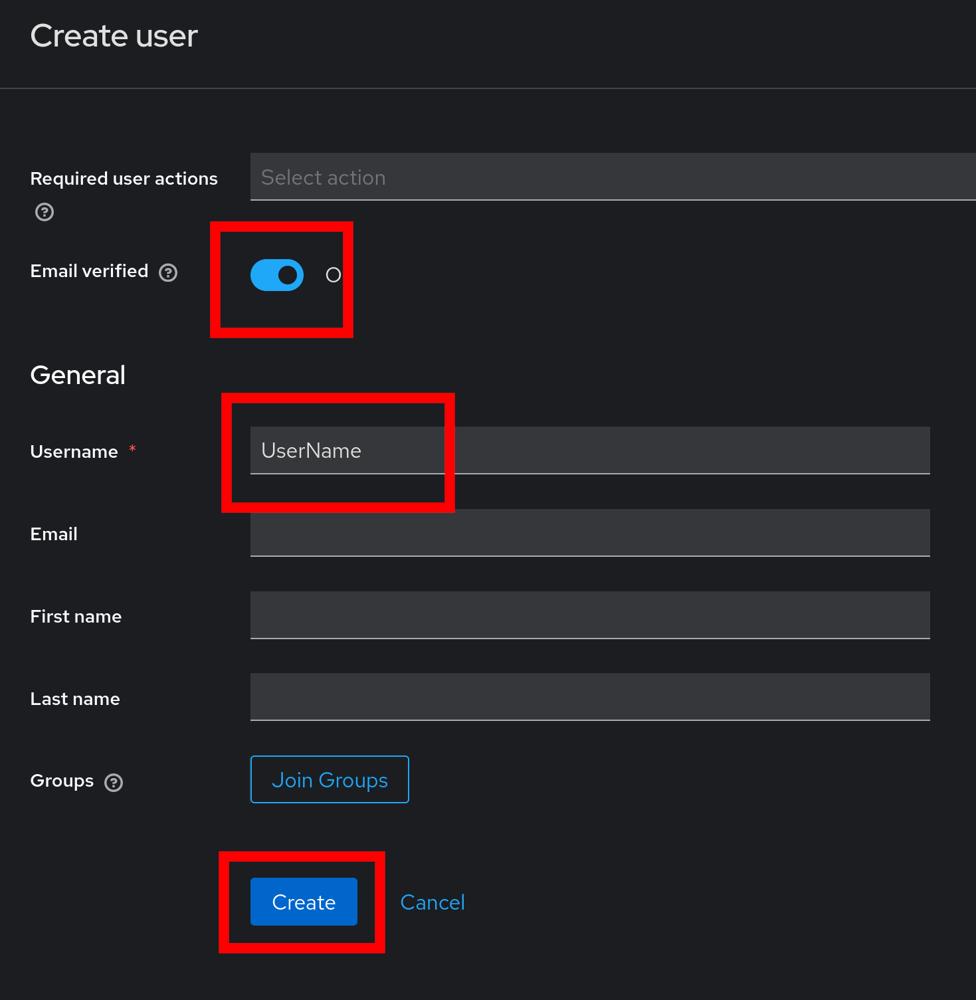
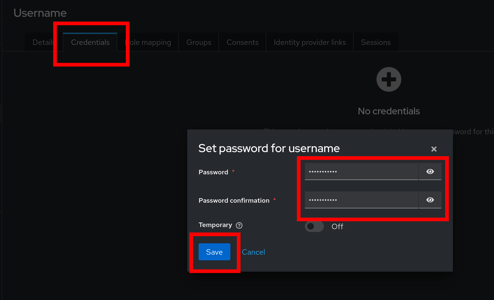

# Quickstart
## Prerequisites

- Docker & Docker Compose
- Reverse Proxy (like Nginx)

## Run the Project
To run OPD (Front- and Backend), follow these steps:

1. Clone/Download this Repository and enter the folder (the following files would be enough: `example.env`, `prepare.sh`, `docker-compose.yml`)
2. Run the `prepare.sh` script. <br> 
(If you are not on Linux or the script fails, you must copy the `example.env`-file to `.env`. After that, replace all `REPLACE_ME`-Strings with secure Strings in the `.env`-file)
3. Modify the `FRONTEND_URL`, `BACKEND_URL` and `KEYCLOAK_URL` in the `.env`-file to your needs.
4. Start the containers with the command: <br> 
    ```shell
    docker compose pull && docker compose up -d
    ``` 
5. After all containers are started, go to the url you set for the `KEYCLOAK_URL`. You can log in with the credentials in the `.env` (`KEYCLOAK_ADMIN_USERNAME` and `KEYCLOAK_ADMIN_PASSWORD`)
6. One logged in, create a new Realm with the name `OPD`: <br>
   
   
7. In the new Realm, create a new Client with the settings: <br>
   `Client ID`: `OPD`
   <br>
   `Home URL`: The Value used for `FRONTEND_URL` in the `.env`-file
   <br>
   `Valid redirect URIs`: The Value used for `FRONTEND_URL` and `BACKEND_URL` in the `.env`-file, **must end with `/*`**
   <br>
   `Valid post logout redirect URIs`: `+`
   <br>
   `Web origins`: `+`
   <br>
   
   
   
8. Now you can create a new User to access OPD (enable `Email verified` when you haven't set up an SMTP-Server in KeyCloak):
   
   
   
9. You should now be able to access OPD by visiting the `FRONTEND_URL`.
   