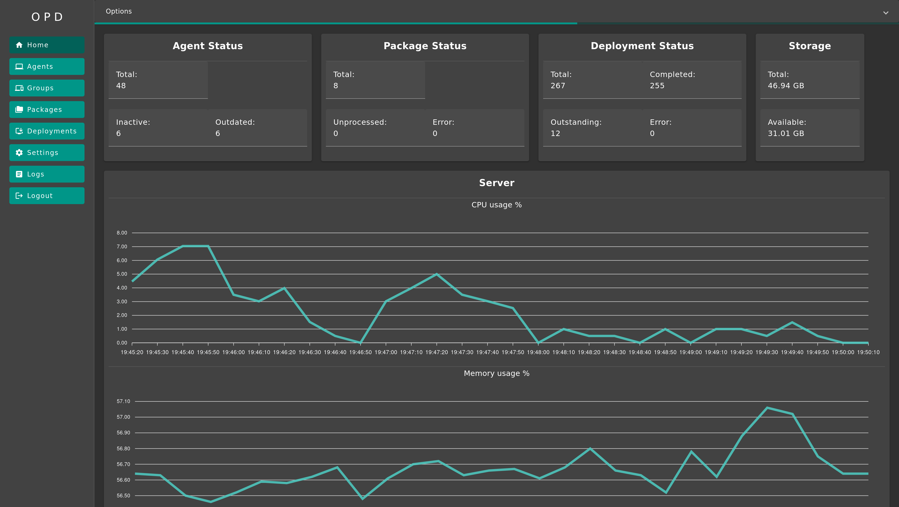

# Open Package Deploy

OPD (Open Package Deploy) allows you to deploy almost everything, everywhere, easily.

The code for the [backend (server and agent)](https://github.com/useless-bit/Open-Package-Deploy-Backend) and
the [frontend](https://github.com/useless-bit/Open-Package-Deploy-Frontend) is available on GitHub.

You can find some screenshots of the UI in the [User Guide](Documentation/User_guide.md) or
this [image folder](Documentation/images/OPD).

<!-- TOC -->
* [Open Package Deploy](#open-package-deploy)
* [Features](#features)
* [What can be deployed](#what-can-be-deployed)
* [Installation](#installation)
* [User Guide](#user-guide)
* [Agent Functionality](#agent-functionality)
  * [When will the agent contact the Server](#when-will-the-agent-contact-the-server)
  * [Update Request Content](#update-request-content)
* [Security](#security)
  * [Agent-Server Communication](#agent-server-communication)
  * [Packages](#packages)
  * [Agent Registration](#agent-registration)
* [Privacy](#privacy)
<!-- TOC -->

# Features

- Simple
- Fast
- Cross-Platform Agent (macOS, Linux, Windows)
- Secure (agent - server communication is fully encrypted and signed)
- Multi-user capable
- Web app is mobile-friendly
- Agent Auto-Update

# What can be deployed

OPD was designed to be usable for many different use cases.

The agent will execute a script (`start.sh` for Linux and macOS and `start.bat` for Windows) that you provide inside a
package. From there, you can do almost anything.

You can get more info in the Guide: [Create a Package](Documentation/create_package.md)

Examples:

* Install software through a package manager or an included installer file
* Copy included files to a destination
* Change system configurations

Example packages will be provided in
this [GitHub repository](https://github.com/useless-bit/Open-Package-Deploy-Packages).

# Installation

To get OPD up and running, follow the [Quickstart Guide](Documentation/Quickstart.md).
There, you will set up OPD, Keycloak and the required databases using Docker and Docker Compose.

Don't forget to check out the [Recommended Keycloak Settings](Documentation/Keycloak_recommended_settings.md)

# User Guide

If you want to learn more about how to use OPD, head over to the [User Guide](Documentation/User_guide.md).

# Agent Functionality

This is a short description of how and when the agent will contact the server and what information is transmitted.

## When will the agent contact the Server

The agent will contact and ask the server for updates in three scenarios:

- Agent Startup
- `Update Interval` timer is expired
- After successfully processing a Package

## Update Request Content

When the agent asks the server for updates, it will get and process the following data:

- Agent Checksum (for Auto Update): Start the auto-update if checksum is different
- `Update Interval`: Update the value in the local config-file and restart the Agent
- Is a deployment available: Start the package download and installation process

# Security

## Agent-Server Communication

The communication between the agent (Endpoint/Client) and the server is fully encrypted and signed.

Every request is first signed and then encrypted using asymmetric cryptography.
The signature is using the `SHA512withECDSA`-algorithm while the encryption uses `ECIES/None/NoPadding`.

If a request is received, the content is first decrypted and then verified with the signature. If an error occurs, the
request gets dropped.

Every agent will generate its own public- and private-keypair. During the registration process, the agent will send its
public-key to the server and gets the servers public-key.

## Packages

All uploaded packages will be encrypted before they can be delivered to agents.
A package will never be sent in plaintext to an agent.

Every package is encrypted using a unique AES-key and IV for the `AES/GCM/NoPadding`-Algorithm.

After the package is uploaded, checksums will be calculated, and the package will be encrypted. The plaintext package
will be deleted afterward.

## Agent Registration

To initiate the registration process, a `Registration Token` needs to be sent. This token is auto-generated on first
start and can be seen and updated/regenerated in the Settings.

# Privacy

OPD will only communicate with its own services (in the `docker-compose.yml`).

OPD has no tracking or analytics features. All data is stored on your system, and nothing is shared.
